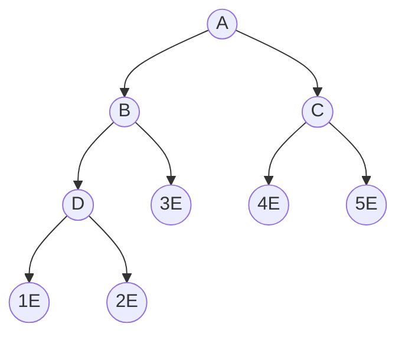

## 如何确定父节点

:::tip

图中 $[A,D]$ 表示内部节点，$[1E,5E]$ 代表外部节点

:::

- 对于 $n$ 个节点的输者树而言，有 $n+1$ 个外部节点
- 最下面一层的最左侧节点，即节点 $D$ 的编号为 $2^S$ ，$S=\lfloor\log_2{n}\rfloor$

- 最底层的外部节点个数  $LowestExternal$  为底层内部节点数的两倍，$LowestExternal=2*(n+1-2^S)$
- 定义 $offset$ 为最底层的外部节点映射到相应的内部节点位置，找出外部节点在输者树中的父节点，$offset=2*2^S-1$ 【 -1 是因为外部节点从索引 1 开始存储】 

- $A=(i+offset)$ 将外部节点映射到内部节点对应位置，$A/2$ 是为了找出父节点

- $(i-\text { LowExt }+n)$  映射到次外层对应内部节点的位置，$n$ 代表输者树中所有节点的数量

  

$$p=\left\{\begin{array}{ll} (i+\text { offset }) / 2 & i \leqslant \text { LowExt } \\ (i-\text { LowExt }+n) / 2 & i>\text { LowExt } \end{array}\right.$$

## 比较

1. 假设存在一个节点  $root$  ，则子节点可以进行比赛的条件是已决出输者的节点是  $root$  节点的右孩子上
2. 
